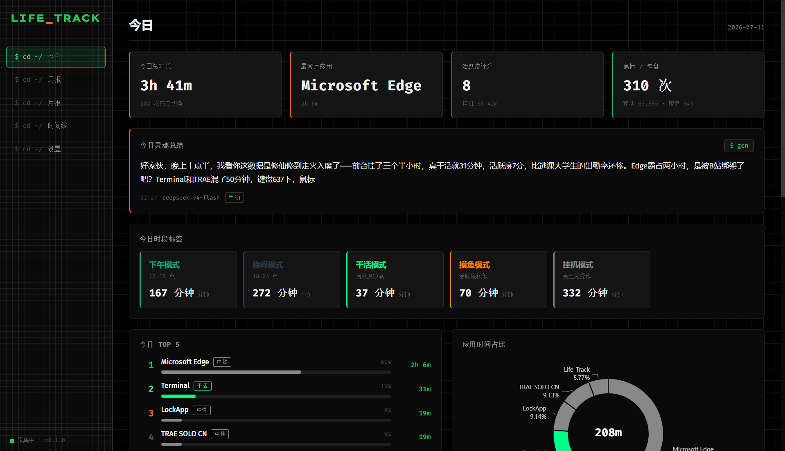

<div align="center">

# Life_Track

### 你的一天，数据说了算

一款**本地运行**的桌面时间追踪仪表盘 —— 自动记录窗口使用与鼠标活跃度，按生活场景打时段标签，再由 AI 写一段毒舌的每日「灵魂总结」。

不用手动起停计时器，不用记日记，开机即跑，后台静默。晚上回过神来，它已经把你今天「以为在写代码、其实在刷抖音」这件事写成了段子。


</div>

---

<p align="center">
  
</p>

---

## 为什么做这个

人对「今天到底干了啥」的记忆严重失真——你以为自己在专注写代码，回头一看，一下午都在刷短视频。市面上的时间追踪软件要么得手动起停计时器（忘一次就漏一天），要么只给你一堆冷冰冰的时长数字，不告诉你这些数字意味着什么。

**Life_Track 想做的只有三件事：**

1. **零干预采集** — 开机自启，托盘常驻，你什么都不用做
2. **场景化标签** — 不给你看「14:00-16:00」，给你看「修仙」「摸鱼」「干活」
3. **灵魂总结** — AI 把数据翻译成人话，每日一针见血

> 数据 100% 本地存储，不上云、不联网、不经第三方服务器（除你自配的 AI 接口外）。

---

## 功能亮点

### 全自动采集，零干预

- **前台窗口追踪**：每 2 秒轮询一次当前活动窗口，同进程多窗口自动归并，连续相同段自动合并
- **鼠标键盘活跃度**：全局监听鼠标移动/点击/按键事件，按 5 秒阈值判定活跃/挂机
- **锁屏感知**：锁屏一律计为挂机，解锁瞬间自动恢复判定
- **应用识别**：内置常见应用映射表（VS Code、Edge、Chrome、微信、QQ...），未命中的自动去 `.exe` 后缀展示
- **黑名单**：不想被记录的应用（全屏游戏、播放器）一键拉黑

### 自定义应用分类

每个应用都可以由你决定属于哪一类：

- **干活** — 写代码、写文档、查资料
- **摸鱼** — 视频、音乐、游戏
- **中性** — 浏览器、IM、文件管理器

在设置页修改分类后，**今日页面和历史数据会立即同步刷新**（含 Top5 应用、时间线、周月报统计）。不需要重新采集，不需要手动迁移历史数据。

### 场景化时段标签

不是冷冰冰的时间区间，而是贴近生活的语义标签：

| 标签 | 触发条件 |
|---|---|
| **修仙模式** | 凌晨 1:00 - 5:00 还在用电脑 |
| **深夜模式** | 23:00 - 次日 5:00 仍在用电脑 |
| **早起模式** | 5:00 - 8:00 开始用电脑 |
| **干饭模式** | 11:00 - 13:00 电脑无操作 |
| **干活 / 摸鱼 / 挂机** | 按活跃度 + 前台应用分类叠加 |

### AI 灵魂总结（三档风格可调）

每晚 23:00 自动调用 OpenAI 兼容接口，把当天数据喂给 AI，生成 120-200 字的总结。**风格三档可选，按你的心情切换：**

| 档位 | 语气 |
|---|---|
| **温柔** | 治愈鼓励、关注成长、温暖提醒 |
| **适中**（默认） | 幽默风趣、毒舌但不恶意 |
| **毒蛇** | 犀利嘲讽、阴阳怪气、一针见血 |

- **感知时间**：深夜催你睡，清晨鼓励你，午后吐槽你犯困
- **感知身份**：在设置页填「程序员」「大学生」「产品经理」，AI 会用贴脸的梗调侃你
- **不泄露隐私**：发给 AI 的只有聚合统计（总时长、Top 应用、标签命中数），**窗口标题原文绝不出本机**
- 支持手动重新生成，支持任意历史日回看

### 全维度可视化

- **今日仪表盘**：总览卡片 + Top5 应用 + 应用占比饼图 + 24 小时活跃度柱图 + 窗口切换时间线
- **周报**：7 天活跃趋势折线图 + 环比对比（涨绿跌橙）+ 周度 Top 应用
- **月报**：日活跃度热力图（类 GitHub 贡献图）+ 月度 Top 应用 + 同期对比
- **时间线**：按分钟颗粒度的纵向时间轴，最近 200 条窗口切换记录

### 数据安全与导出

- **纯本地存储**：sql.js (SQLite WASM) 数据库，所有数据存在本地 `data/` 目录
- **原子持久化**：写 `.tmp` → 备份旧文件为 `.bak` → 原子替换，崩溃不丢数据
- **持久化失败可见**：写盘失败时顶部红色横幅提示，数据仍在内存中不丢失
- **CSV / JSON 导出**：支持窗口记录、活跃度日志、时段标签、灵魂总结四张表

### 体验细节

- **托盘常驻**：关闭窗口不退出，最小化到托盘后台继续采集
- **开机自启**：设置页一键开启，开机即静默运行
- **单实例锁**：防止多开导致采集重复
- **崩溃恢复**：渲染进程崩溃自动重启（最多 5 次），退出前自动 flush 数据
- **状态联动**：托盘切换暂停/恢复，设置页 UI 同步更新，不再错乱

---

## 快速开始

### 方式一：直接下载安装包（推荐普通用户）

前往 [Releases](https://github.com/CoddeOreo-pixel/Life_Track/releases) 下载 `Life_Track Setup x.x.x.exe`，双击安装即可。

- 安装包支持**覆盖升级**（直接装到原路径，配置和数据不丢）
- 卸载重装数据也不会丢（数据存在 `%APPDATA%/Life_Track/`，与程序目录隔离）

### 方式二：源码运行

#### 环境要求

- Node.js ≥ 18
- npm ≥ 9
- Windows（窗口采集依赖 Windows API，macOS/Linux 需自行适配）

#### 安装与运行

```bash
# 克隆仓库
git clone https://github.com/CoddeOreo-pixel/Life_Track.git
cd Life_Track

# 安装依赖
npm install

# 启动开发模式
npm run dev
```

应用启动后会自动最小化到系统托盘，点击托盘图标或任务栏图标即可打开主界面。

#### 打包成安装包

```bash
npm run pack
```

打包产物在 `dist/` 目录，Windows 下为 NSIS 安装包（`Life_Track Setup x.x.x.exe`）。

### 配置 AI 总结（可选）

1. 打开应用 → 设置 → AI 灵魂总结
2. 选择**总结风格**（温柔 / 适中 / 毒蛇）
3. 填写接口地址（默认 `https://api.openai.com/v1`，支持任何 OpenAI 兼容服务）
4. 填写 API Key 和模型名（推荐 `gpt-4o-mini`，便宜够用）
5. 填写你的身份（如「前端程序员」「大学生」），让 AI 的吐槽更贴脸
6. 设置自动生成时间（默认 23:00）

不配置也能正常用，只是没有灵魂总结功能。

---

## 项目结构

```
Life_Track/
├── electron/
│   ├── main/
│   │   ├── collector/
│   │   │   ├── windowCollector.ts    # 窗口采集器（2s 轮询 + 去重合并）
│   │   │   └── activityCollector.ts  # 活跃度采集器（全局事件 + 每分钟聚合）
│   │   ├── native/
│   │   │   └── winForeground.ts      # Windows API 封装（koffi FFI）
│   │   ├── db/
│   │   │   ├── index.ts              # sql.js 初始化 + 原子持久化 + 迁移
│   │   │   ├── schema.sql            # 表结构定义
│   │   │   ├── queries.ts            # 查询服务
│   │   │   ├── tagEngine.ts          # 时段标签计算引擎
│   │   │   └── appMappings.ts        # 应用识别映射 + 分类同步 + 历史修复
│   │   ├── ai/
│   │   │   └── summaryEngine.ts      # AI 灵魂总结引擎（三档风格 + 定时调度）
│   │   ├── tray.ts                   # 系统托盘
│   │   └── index.ts                  # 主进程入口
│   ├── preload/
│   │   └── index.ts                  # contextBridge 安全暴露 IPC
│   └── shared/
│       └── types.ts                  # 主进程/渲染进程共享类型
├── src/
│   ├── routes/
│   │   ├── Today.tsx                 # 今日仪表盘
│   │   ├── Weekly.tsx                # 周报
│   │   ├── Monthly.tsx               # 月报（含热力图）
│   │   ├── Timeline.tsx              # 时间线
│   │   └── Settings.tsx              # 设置页（含分类管理 + 风格档位）
│   ├── components/
│   │   ├── Chart.tsx                 # ECharts 封装
│   │   ├── Charts.tsx                # 各类图表配置
│   │   ├── OverviewCards.tsx         # 总览卡片
│   │   ├── TopAppsList.tsx           # Top 应用列表
│   │   ├── TimeTags.tsx              # 时段标签展示
│   │   ├── SummaryCard.tsx           # 灵魂总结卡片
│   │   └── WindowTimeline.tsx        # 窗口切换时间线
│   ├── stores/
│   │   ├── today.ts                  # 今日数据 store
│   │   └── range.ts                  # 周月报数据 store
│   ├── lib/
│   │   └── format.ts                 # 格式化工具
│   └── styles/
│       └── brutalism.css             # 野兽主义网格主题
├── build/
│   ├── icon.png                      # 应用图标源
│   └── icon.ico                      # Windows 图标
├── scripts/
│   └── generate-icon.js              # 图标生成脚本
└── package.json
```

---

## 技术栈

| 层 | 技术 | 选型理由 |
|---|---|---|
| 桌面壳 | **Electron 31** | 采集 + 展示一体化，跨平台 |
| 前端框架 | **React 18 + Vite 5** | 主流方案，热更新快 |
| 图表 | **ECharts 5** | 饼图/柱图/折线/热力图全覆盖 |
| 状态管理 | **Zustand 4** | 轻量，避免 Redux 样板代码 |
| 路由 | **React Router v6** | 日/周/月/时间线视图切换 |
| 本地数据库 | **sql.js (SQLite WASM)** | 纯 WASM 无需原生编译，跨平台 |
| Windows API | **koffi** | 预编译 FFI，无需 Visual Studio |
| 全局输入监听 | **uiohook-napi** | 跨平台全局鼠标键盘 hook |
| AI 接入 | **OpenAI 兼容 fetch** | 用户自填 base_url + key |
| 进程通信 | **Electron IPC (contextBridge)** | contextIsolation 安全隔离 |

---

## 数据流

```
[前台窗口] ─2s 轮询─► [windowCollector] ─去重合并─► ┐
                                                  │
[全局鼠标/键盘] ─事件流─► [activityCollector]      │
                          ─5s 阈值─► ─每分钟聚合─► │
                                                  ▼
                                          [sql.js 内存库]
                                                  │
                                  ┌───────────────┤
                                  ▼               ▼
                          [IPC 查询服务]   [每 10s 原子写盘]
                                  │
                                  ▼
                          [React 仪表盘]
                                  │
                          [每晚 23:00]
                                  ▼
                      [AI 灵魂总结] ─► [daily_summaries]
                                  （温柔 / 适中 / 毒蛇 三档可选）
```

---

## 设计理念

### 野兽主义网格视觉

界面遵循**野兽主义（Brutalism）网格**风格，主张「功能即美学」：

- **纯黑底** + 亮绿 `#22c55e` 主色 + 亮橙 `#ff6b00` 强调色
- **等宽字体**（Fira Code / Cascadia Code）贯穿全局，营造终端式克制感
- **6px 硬圆角** + 粗边框，拒绝圆滑讨好的「廉价感」
- **网格纹理**背景，强化「数据仪表盘」的工程气质（密度经过反复调校，宽松不压抑）
- 按钮采用终端命令风格（`$ pause` / `$ resume` / `$ csv`），克制而精准

### 隐私优先

- 窗口标题**全量记录但绝不上传**，发给 AI 的只有聚合统计
- 鼠标/键盘**只记事件次数，不记坐标和按键内容**
- 所有数据存在本地 `data/` 目录，删了就是真的删了
- API Key 明文存在本地 SQLite（单用户本机场景，可接受；如需加密请用 `safeStorage` 自行扩展）

---

## 开发指南

### 常用命令

```bash
npm run dev        # 开发模式（热更新）
npm run build      # 构建产物到 out/
npm run pack       # 构建并打包为安装包到 dist/
npm run rebuild    # 重建 uiohook-napi 原生模块
```

### 图标自定义

替换项目根目录的 `Life_Track.png`（建议 2048×2048 透明 PNG），然后运行：

```bash
node scripts/generate-icon.js
```

脚本会自动生成 `build/icon.png`（1024×1024）和 `build/icon.ico`（多尺寸），使用双线性插值保证小尺寸下清晰度。

### 数据库迁移

应用启动时自动执行 `runMigrations()`，通过 `PRAGMA table_info` 检查列是否存在 + `ALTER TABLE ADD COLUMN` 实现向前兼容。新增字段无需手动迁移。

启动时还会自动执行 `repairEmptyDisplayNames()`，修复历史脏数据（空 display_name），确保 Top 应用列表始终显示软件名。

### 调试

- 主进程日志：终端控制台
- 渲染进程：`Ctrl+Shift+I` 打开 DevTools
- 数据库查看：导出 JSON 后用任意 SQLite 工具查看，或直接读取 `data/life_track_data.bin`

---

## 路线图

- [x] M1-M8 全部里程碑完成
- [x] 窗口采集 + 活跃度采集 + 时段标签
- [x] 今日/周报/月报/时间线四视图
- [x] AI 灵魂总结 + 定时调度
- [x] 数据导出 + 黑名单 + 应用映射
- [x] 托盘常驻 + 开机自启
- [x] 野兽主义暗色主题
- [x] **自定义应用分类（干活/摸鱼/中性）+ 历史数据同步**
- [x] **AI 总结风格档位（温柔/适中/毒蛇）**
- [x] **托盘/设置页状态联动**
- [ ] 静默启动（开机自启时不弹窗）
- [ ] 时间线筛选与缩放
- [ ] 月报 30 天柱状图
- [ ] 数据清除功能
- [ ] macOS/Linux 窗口采集适配

---

## 更新日志

### v0.1.3

- 🎭 **AI 总结风格档位**：新增温柔 / 适中 / 毒蛇三档可选，设置页一键切换
- 🏷️ **自定义应用分类**：每个应用可自定义属于干活/摸鱼/中性，修改后历史数据立即同步
- 🐛 修复修改分类后软件名丢失的问题（`display_name` 不再被空串覆盖）
- 🐛 修复托盘切换采集状态后设置页 UI 不同步的问题
- 🐛 修复采集器重启时 `powerMonitor` 监听器累积导致内存泄漏
- 🐛 修复启动时若上次为暂停态会写入 0 时长脏 session 的问题
- ⚡ 优化 `getOverview` 查询性能（4 次子查询 → 2 次独立查询）
- 🛠️ 启动时自动修复历史脏数据，确保 Top 应用列表始终显示软件名

### v0.1.2

- 📤 数据导出功能（CSV / JSON）
- 🏷️ 自定义应用分类（干活/摸鱼/中性）
- 🐛 修复进程名 `.exe` 后缀匹配失效
- 🐛 修复修改分类后历史 `window_sessions` 不同步

### v0.1.1

- 🖼️ README 添加应用截图
- 📦 Release 下载入口
- 🎨 侧边栏网格密度优化（12px → 32px，透明度 0.08 → 0.05）

### v0.1.0

- 🎉 首个发布版本
- 窗口采集 + 活跃度采集 + 时段标签
- 今日/周报/月报/时间线四视图
- AI 灵魂总结 + 定时调度
- 托盘常驻 + 开机自启

---

## 许可证

MIT License — 详见 [LICENSE](LICENSE)

---

<div align="center">

**如果这个项目对你有帮助，欢迎 Star ⭐**

Made with `console.log('加班到深夜')` and ☕

</div>
