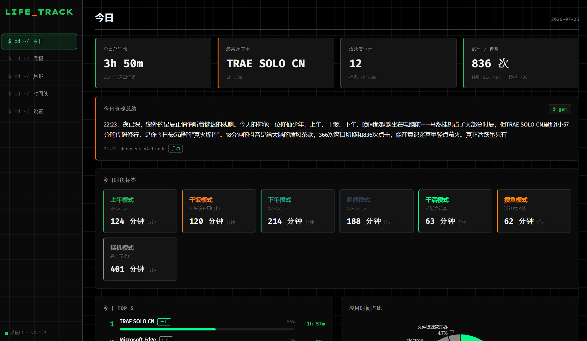

<p align="center">
  <a href="README.md">🇨🇳 中文</a> &nbsp;|&nbsp; <a href="README_EN.md">🇺🇸 English</a>
</p>

<div align="center">

# Life_Track

### Your day, in data

A **local-first** desktop time tracking dashboard — automatically records window usage and mouse/keyboard activity, tags your day into life scenarios, then lets AI write a daily "soul summary" with attitude.

No manual timers, no daily journaling. Just install and forget. By nightfall, it's already turned your "I totally coded all afternoon" into a roast about how you actually doom-scrolled TikTok for 3 hours.


[](https://github.com/CoddeOreo-pixel/Life_Track/stargazers)

</div>

---

<p align="center">
  
</p>

---

## Why this exists

Human memory of "what the hell did I do today" is notoriously unreliable. You think you were grinding on code — turns out you spent the afternoon on YouTube. Existing time trackers either require manual timers (forget once, lose a day) or drown you in raw numbers without context.

**Life_Track does three things and three things only:**

1. **Zero-effort tracking** — auto-start on boot, runs in the system tray
2. **Scenario tagging** — instead of "14:00-16:00", it shows "Coding Mode" / "Procrastination Mode"
3. **Soul summary** — AI translates your data into a brutally honest daily roast

> 100% local storage. No cloud, no telemetry, no third-party servers (except the AI API you configure).

---

## Features

### ⚡ Zero-Effort Tracking

- **Foreground window tracking** — polls every 2s, auto-merges consecutive identical sessions
- **Mouse & keyboard activity** — global hooks monitor movement, clicks, and key presses; 5s threshold detects active/idle
- **Lock screen aware** — counts as idle immediately, resumes on unlock
- **App recognition** — built-in mapping for 70+ common apps (VS Code, Edge, Chrome, WeChat, QQ...)
- **Blacklist** — exclude apps you don't want tracked (games, media players)

### 🏷️ Custom App Categories

Tag any app as one of three types:

| Category | Examples |
|---|---|
| **Work** | Coding, documents, research |
| **Entertainment** | Videos, music, games |
| **Neutral** | Browser, IM, file manager |

Changes take effect instantly — **today's Top 5, timeline, and weekly/monthly reports update immediately**. No re-collection, no manual migration.

### 🌙 Scenario Tags

Real-life semantic tags instead of raw timestamps:

| Tag | Trigger |
|---|---|
| **Nerd Mode** | Active between 1:00 AM – 5:00 AM |
| **Night Owl** | Active between 11:00 PM – 5:00 AM |
| **Early Bird** | Active between 5:00 AM – 8:00 AM |
| **Lunch Break** | Inactive between 11:00 AM – 1:00 PM |
| **Work / Slacking / Idle** | Based on activity + app category |

### 🤖 AI Soul Summary (3 Tone Levels)

Every night at 11:00 PM, Life_Track calls your configured OpenAI-compatible API to generate a 120-200 word summary. **Choose your tone:**

| Level | Vibe | Temperature |
|---|---|---|
| **Gentle** | Encouraging, warm, growth-focused | 0.8 |
| **Balanced** (default) | Witty, sarcastic but not mean | 0.9 |
| **Toxic** | Ruthless, brutal, zero filter | 1.0 |

- **Time-aware** — scolds you for being up at 3 AM, cheers you on in the morning
- **Identity-aware** — set your role (developer / student / PM) for personalized roasts
- **Privacy-first** — only aggregate stats sent to AI (total hours, top apps, tags). **Window titles never leave your machine**

### 📊 Full Visualization Suite

- **Today Dashboard** — overview cards + Top 5 apps + pie chart + 24h activity bars + window timeline
- **Weekly Report** — 7-day activity trend line + week-over-week comparison (green = up, orange = down)
- **Monthly Report** — GitHub-style heatmap + **30-day active duration bar chart** + Top apps + period comparison
- **Timeline** — minute-granularity time axis with **app name search + category filter**

### 🛡️ Data Security & Export

- **100% local** — sql.js (SQLite WASM), no cloud dependency
- **Atomic persistence** — write to `.tmp` → backup `.bak` → atomic swap; crash-safe
- **CSV / JSON export** — window sessions, activity log, daily tags, soul summaries
- **Data clearing** — delete by date range or wipe everything (with confirmation dialog)

### 🎯 Quality of Life

- **Silent startup** — auto-launches to tray without popping a window
- **State sync** — toggling from tray instantly updates Settings page UI
- **Crash recovery** — renderer process auto-restarts (up to 5 times), flushes data on exit
- **Single instance lock** — prevents duplicate collectors

---

## Quick Start

### 🚀 Option 1: Download Installer

Go to [Releases](https://github.com/CoddeOreo-pixel/Life_Track/releases) and grab `Life_Track Setup x.x.x.exe`. Double-click to install.

> Supports **in-place upgrade**. Data lives in `%APPDATA%/Life_Track/` — safe across reinstall/uninstall.

### 💻 Option 2: Run from Source

```bash
# Clone
git clone https://github.com/CoddeOreo-pixel/Life_Track.git
cd Life_Track

# Install dependencies
npm install

# Start dev mode
npm run dev
```

```bash
# Build installer
npm run pack
```

Output in `dist/` — Windows NSIS installer (`Life_Track Setup x.x.x.exe`).

### ⚙️ Configure AI Summary (Optional)

1. Open app → Settings → AI Soul Summary
2. Pick your **tone** (Gentle / Balanced / Toxic)
3. Enter API base URL (defaults to `https://api.openai.com/v1`)
4. Enter API Key and model (`gpt-4o-mini` recommended)
5. Set your identity for personalized roasts
6. Set auto-generation time (default 11:00 PM)

> Works fine without AI config — you just won't get summaries.

---

## Project Structure

```
Life_Track/
├── electron/
│   ├── main/
│   │   ├── collector/          # Window + activity collectors
│   │   ├── native/             # Windows API (koffi FFI)
│   │   ├── db/                 # sql.js database + queries + tag engine
│   │   ├── ai/                 # AI summary engine (3 tone levels)
│   │   ├── tray.ts             # System tray
│   │   └── index.ts            # Main process entry
│   ├── preload/                # contextBridge secure IPC
│   └── shared/                 # Shared types (main ↔ renderer)
├── src/
│   ├── routes/                 # Today / Weekly / Monthly / Timeline / Settings
│   ├── components/             # Charts, cards, timeline
│   ├── stores/                 # Zustand state management
│   └── styles/                 # Brutalism grid theme
└── build/                      # App icons
```

---

## Tech Stack

| Layer | Tech | Why |
|---|---|---|
| Shell | **Electron 31** | Unified collection + UI |
| Frontend | **React 18 + Vite 5** | Fast HMR, mainstream |
| Charts | **ECharts 5** | Pie/bar/line/heatmap |
| State | **Zustand 4** | Lightweight, no boilerplate |
| Database | **sql.js (SQLite WASM)** | Pure WASM, no native build |
| Windows API | **koffi** | Prebuilt FFI, no VS required |
| Global Hooks | **uiohook-napi** | Cross-platform input capture |
| AI | **OpenAI-compatible fetch** | BYO base_url + key |
| IPC | **Electron contextBridge** | contextIsolation secure |

---

## Data Flow

```
[Foreground window] ─2s poll─► [windowCollector] ─► ┐
[Mouse/Keyboard] ─events─► [activityCollector]      │
                                                    ▼
                                            [sql.js in-memory DB]
                                              │           │
                                              ▼           ▼
                                      [IPC query]    [10s atomic flush]
                                              │
                                              ▼
                                      [React dashboard]
                                              │
                                      [11:00 PM nightly] ─► [AI Soul Summary]
                                                              Gentle / Balanced / Toxic
```

---

## Design Philosophy

### 🎨 Brutalism Grid

- **Pure black** background + `#22c55e` green + `#ff6b00` orange
- **Monospace font** (Fira Code / Cascadia Code) throughout — terminal-inspired restraint
- **6px hard-radius** borders — no rounded-corners gentrification
- **Grid texture** background reinforcing the "data dashboard" engineering vibe
- Buttons use terminal-command style: `$ pause` / `$ resume` / `$ csv`

### 🔒 Privacy First

- Window titles are **recorded locally but never uploaded** — only aggregates sent to AI
- Mouse/keyboard tracks **event counts only**, not coordinates or key content
- All data lives on your machine — delete it and it's really gone

---

## Dev Guide

```bash
npm run dev        # Dev mode (HMR)
npm run build      # Build to out/
npm run pack       # Build + package to dist/
npm run rebuild    # Rebuild uiohook-napi native module
```

Debugging:
- Main process logs: terminal console
- Renderer: `Ctrl+Shift+I` for DevTools
- Database: export JSON, open with any SQLite viewer

---

## Roadmap

- [x] Window & activity collection + scenario tags
- [x] Today / Weekly / Monthly / Timeline views
- [x] AI soul summary + scheduled generation
- [x] Data export + blacklist + app mapping
- [x] Custom app categories + history sync
- [x] AI summary tone levels (Gentle/Balanced/Toxic)
- [x] **Silent startup (no window on boot)**
- [x] **Data clearing (by date / wipe all)**
- [x] **30-day monthly activity bar chart**
- [x] **Timeline search + category filter**
- [ ] macOS / Linux window tracking support

---

## Changelog

### v0.1.3 — Silent Startup + Data Clearing + Monthly Bar Chart + Timeline Filters

**New features:**
- 💤 Silent startup (no popup on auto-launch)
- 🗑️ Data clearing (by date or full wipe with confirmation)
- 📊 30-day activity bar chart on Monthly page
- 🔍 Timeline app name search + category filtering
- 🎭 AI summary tone selection (Gentle/Balanced/Toxic)
- 🏷️ Custom app categories with history sync

**Bug fixes:**
- Lost app name after category change (empty display_name)
- Settings page UI not syncing with tray toggle
- PowerMonitor listener leak on collector restart
- Dirty session written on paused-state startup
- Auto-repair empty display names on startup

**Performance:**
- `getOverview` query reduced from 4 to 2 scans

### v0.1.2 — Data Export + Category Sync

- CSV / JSON export
- Custom app categories
- `.exe` suffix fuzzy matching, history sync fix

### v0.1.1 — README + Grid Tuning

- Added screenshots to README
- Sidebar grid density optimization

### v0.1.0 — Initial Release

- Window & activity collection + scenario tags
- 4 dashboard views + AI summary + tray + auto-start

---

## License

MIT License — See [LICENSE](LICENSE)

---

<div align="center">

**If this project helps you, consider giving it a Star ⭐**

Made with `console.log('burning midnight oil')` and ☕

</div>
